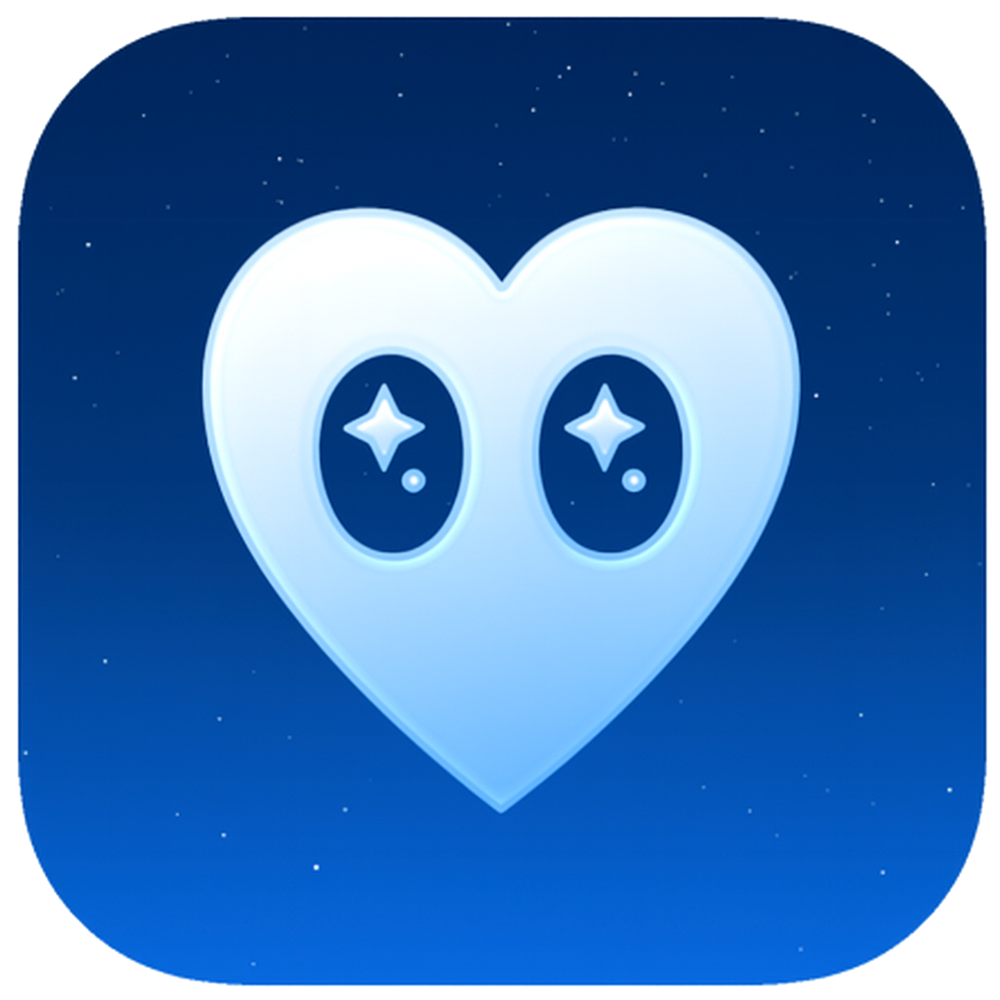
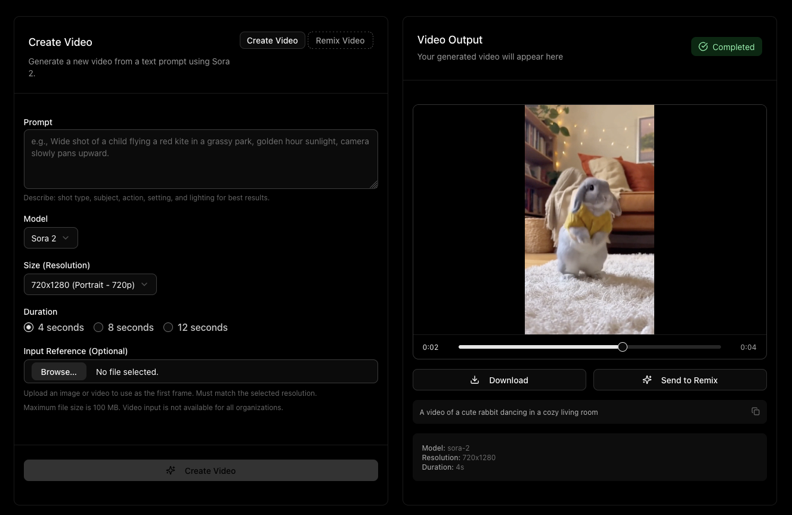
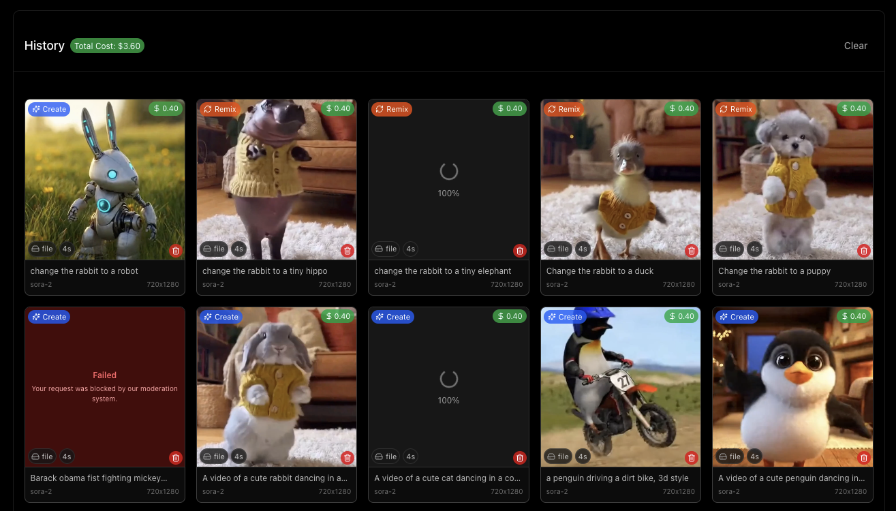
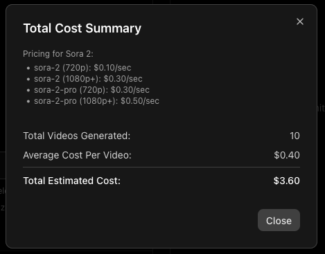

#  Sora 2 Playground

A web-based playground to interact with OpenAI's Sora 2 models for creating videos.

<p align="center">
  
</p>

## ✨ Features

*   **🎬 Video Creation Mode:** Generate new videos from text prompts using Sora 2 or Sora 2 Pro.
*   **🎨 Video Remix Mode:** Make targeted changes to existing videos with new prompts.
*   **⚙️ Full API Parameter Control:** Access and adjust all relevant parameters supported by the Sora 2 API directly through the UI (model selection, resolution, duration, optional input reference for first frame).
*   **🔄 Multi-Video Queuing:** Queue multiple videos for generation simultaneously - create as many videos as you want while others are processing.

*   **📜 Detailed History & Cost Tracking:**
    *   View a comprehensive history of all your video generations and remixes.
    *   See the parameters used for each request (model, resolution, duration, prompt).
    *   Get detailed cost breakdowns (`$USD`) for each video. (hint: click the `$` amount on the video)
    *   Real-time progress tracking for videos currently being generated.
    *   Click any prompt to copy the full text.
    *   View total historical API cost.
    *   Delete individual videos from history (removes from local storage and OpenAI servers).
    *   Failed requests are tracked separately with error messages and excluded from cost calculations.

<p align="center">
  
</p>

<p align="center">
  
</p>

*   **🎥 Video Output Panel:** View generated videos with built-in player controls, progress slider, and playback controls.
*   **🚀 Send to Remix:** Quickly send any completed video (including remixes) to the remix form for further modifications.
*   **📥 Video Download:** Download generated videos directly to your device.
*   **💾 Storage:** Supports two modes via `NEXT_PUBLIC_FILE_STORAGE_MODE`:
    *   **Filesystem (default):** Videos saved to `./generated-videos` on the server (includes video, thumbnail, and spritesheet).
    *   **IndexedDB:** Videos saved directly in the browser's IndexedDB (ideal for serverless deployments like Vercel).
    *   Video history metadata is always saved in the browser's local storage.
    *   Active job IDs are persisted - resume polling automatically after page refresh.

## ▲ Deploy to Vercel

🚨 *CAUTION: If you deploy from `main` or `master` branch, your Vercel deployment will be **publicly available** to anyone who has the URL. Deploying from other branches will require users to be logged into Vercel (on your team) to access the preview build.* 🚨

You can deploy your own instance of this playground to Vercel with one click:

[](https://vercel.com/new/clone?repository-url=https://github.com/alasano/sora-2-playground&env=OPENAI_API_KEY,NEXT_PUBLIC_FILE_STORAGE_MODE,APP_PASSWORD&envDescription=OpenAI%20API%20Key%20is%20required.%20Set%20storage%20mode%20to%20indexeddb%20for%20Vercel%20deployments.&project-name=sora-2-playground&repository-name=sora-2-playground)

You will be prompted to enter your `OPENAI_API_KEY` and `APP_PASSWORD` during the deployment setup. For Vercel deployments, it's required to set `NEXT_PUBLIC_FILE_STORAGE_MODE` to `indexeddb`.

Note: If `NEXT_PUBLIC_FILE_STORAGE_MODE` is not set, the application will automatically detect if it's running on Vercel and default to `indexeddb` mode. Otherwise (e.g., running locally), it defaults to `fs` mode. You can always explicitly set the variable to `fs` or `indexeddb` to override this automatic behavior.

## 🚀 Getting Started [Local Deployment]

Follow these steps to get the playground running locally.

### Prerequisites

*   [Node.js](https://nodejs.org/) (Version 20 or later required)
*   [npm](https://www.npmjs.com/), [yarn](https://yarnpkg.com/), [pnpm](https://pnpm.io/), or [bun](https://bun.sh/)

### 1. Set Up API Key 🟢

You need an OpenAI API key to use this application.

⚠️ **Your OpenAI Organization needs access to Sora 2 API** - This is currently in limited beta. Check [OpenAI's documentation](https://platform.openai.com/docs) for availability.

1.  If you don't have a `.env.local` file, create one.
2.  Add your OpenAI API key to the `.env.local` file:

    ```dotenv
    OPENAI_API_KEY=your_openai_api_key_here
    ```

    **Important:** Keep your API key secret. The `.env.local` file is included in `.gitignore` by default to prevent accidental commits.

---

#### 🟡 (Optional) IndexedDB Mode (for serverless hosts) [e.g. Vercel]

For environments where the filesystem is read-only or ephemeral (like Vercel serverless functions), you can configure the application to store generated videos directly in the browser's IndexedDB using Dexie.js.

Set the following environment variable in your `.env.local` file or directly in your hosting provider's UI (like Vercel):

```dotenv
NEXT_PUBLIC_FILE_STORAGE_MODE=indexeddb
```

When this variable is set to `indexeddb`:
*   The server API downloads videos from OpenAI and streams them to the client.
*   The client-side application stores the video blob (and thumbnail) in IndexedDB.
*   Videos are served directly from the browser's storage using Blob URLs.

If this variable is **not set** or has any other value, the application defaults to the standard behavior of saving videos to the `./generated-videos` directory on the server's filesystem (includes `{id}_video.mp4`, `{id}_thumbnail.webp`, and `{id}_spritesheet.jpg`).

**Note:** If `NEXT_PUBLIC_FILE_STORAGE_MODE` is not set, the application will automatically detect if it's running on Vercel and default to `indexeddb` mode. Otherwise (e.g., running locally), it defaults to `fs` mode. You can always explicitly set the variable to `fs` or `indexeddb` to override this automatic behavior.

#### 🟡 (Optional) Use a Custom API Endpoint

If you need to use an OpenAI-compatible API endpoint (e.g., a local model server or a different provider), you can specify its base URL using the `OPENAI_API_BASE_URL` environment variable in your `.env.local` file:

```dotenv
OPENAI_API_KEY=your_openai_api_key_here
OPENAI_API_BASE_URL=your_compatible_api_endpoint_here
```

If `OPENAI_API_BASE_URL` is not set, the application will default to the standard OpenAI API endpoint.

---


#### 🟡 (Optional) Enable Password Validation
```dotenv
APP_PASSWORD=your_password_here
```
When `APP_PASSWORD` is set, the frontend will prompt you for a password to authenticate requests.
<p align="center">
  
</p>

---

### 2. Install Dependencies 🟢

Navigate to the project directory in your terminal and install the necessary packages:

```bash
npm install
# or
# yarn install
# or
# pnpm install
# or
# bun install
```

### 3. Run the Development Server 🟢

Start the Next.js development server:

```bash
npm run dev
# or
# yarn dev
# or
# pnpm dev
# or
# bun dev
```

### 4. Open the Playground 🟢

Open [http://localhost:3000](http://localhost:3000) in your web browser. You should now be able to use the Sora 2 Playground!

## 🤝 Contributing

Contributions are welcome! Issues and feature requests, not as much welcome but I'll think about it.

## 📄 License

MIT
